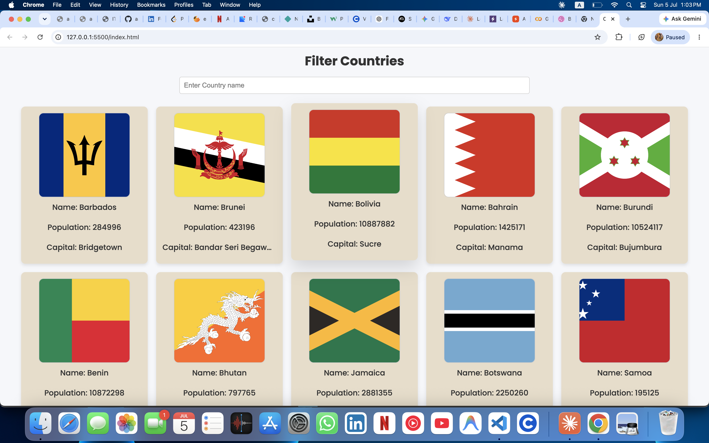

<h1 align="center">🌍 Countries Explorer</h1>

<p align="center">
  
  
  
</p>

<p align="center">
  A sleek, no-framework web app for searching and browsing countries in real time, powered by a live REST API.
</p>

---

## 📖 Table of Contents

- [Features](#-features)
- [Tech Stack](#-tech-stack)
- [Demo](#-demo)
- [Getting Started](#-getting-started)
- [API Reference](#-api-reference)
- [Project Structure](#-project-structure)
- [License](#-license)

---

## ✨ Features

- 🔍 **Live search** — instantly filter countries by name as you type
- ⚡ **Live API data** — country data is fetched fresh from a public REST API
- 📱 **Responsive cards** — clean, hover-animated cards that adapt to any screen size
- 🛡️ **Error handling** — graceful loading state and error messages if the API call fails

---

## 🛠️ Tech Stack

| Layer      | Technology                  |
| ---------- | ---------------------------- |
| Structure  | HTML5                        |
| Styling    | CSS3 (Flexbox, Google Fonts) |
| Logic      | Vanilla JavaScript (ES6+)    |
| Data       | REST API (`fetch`)           |

---

## 🎬 Demo



---

## 🚀 Getting Started

Follow these steps to run the app locally:

1. **Clone the repository**

   ```bash
   git clone https://github.com/aaiz-ahmadd/Countries-Explorer.git
   ```

2. **Navigate into the project folder**

   ```bash
   cd Countries-Explorer
   ```

3. **Open `index.html` in your browser**

   ```bash
   open index.html
   ```

   > No build step, no dependencies — it's plain HTML, CSS, and JavaScript.

---

## 🔌 API Reference

This app fetches country data from the [Sample APIs](https://sampleapis.com/) **Countries** endpoint:

```
GET https://api.sampleapis.com/countries/countries
```

Each country record includes fields such as `name`, `capital`, `population`, and `media.flag`, which are used to render the info cards.

---

## 📁 Project Structure

```
Countries-Filter-App/
├── index.html      # App markup and layout
├── style.css       # Styling for cards, layout, and responsiveness
├── script.js       # Fetching, rendering, and search logic
├── LICENSE         # MIT License
└── README.md       # Project documentation
```

---

## 📄 License

This project is licensed under the [MIT License](LICENSE).
